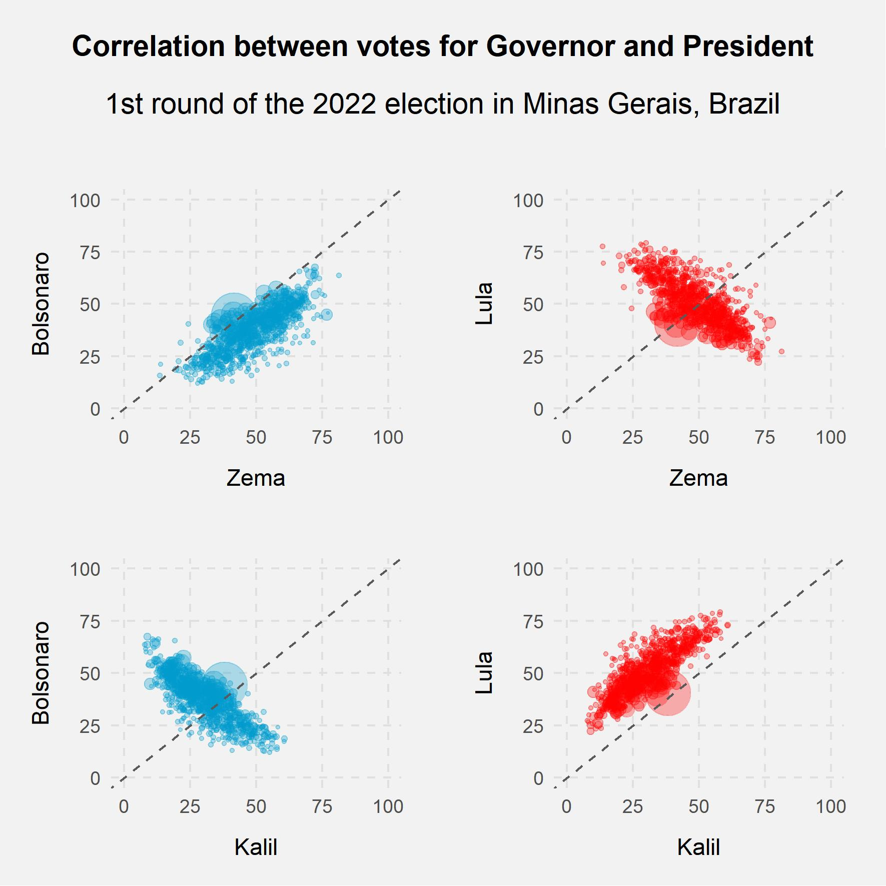
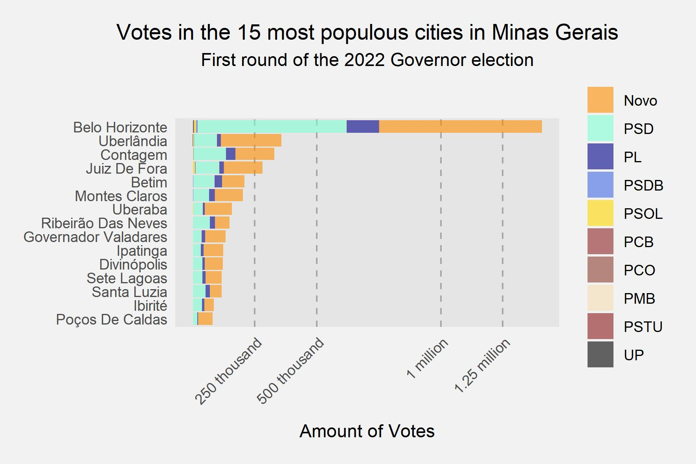

# Analysis of electoral performances in Minas Gerais (2010-2022)

Minas Gerais is a decisive state for Brazilian elections, not only because of its 20 million inhabitants and 16 million voters (10.41% of the national electorate), but also because, since redemocratization in 1985, all elected Presidents have obtained a majority in the State.

in Brazil, the computation is done considering each vote individually, the winner is whoever reaches the majority of valid votes (excluding blank and null votes).

Thus, although there is this coincidence between the Minas Gerais and Brazilian elections, the State is not decisive for the victory of a candidate, and the performance of a candidate may be much better in other States enough to guarantee victory.

However, this coincidence has occurred since the redemocratization.

Despite this eventuality, the distribution of votes in the State has changed over the years, following the political transformations in the country.

From a more homogeneous distribution in the State, it moved to a heterogeneous distribution demarcated by the mesoregions.

On the other hand, the election for Governor proved to be relatively independent of the national elections, in which the election for President was not followed by the co-religionist at the state level.

In the first round of elections for Governor and President in 2022, the correlation between voters of the candidate for the Government, Zema, and the candidate for the Presidency, Bolsonaro, proved to be stronger than the relationship between Lula and Kalil, candidates for the Presidency and for the Government , respectively.

Although these relations between the Presidential and State Elections for Governors may indicate a correlation of the electorate, there is a disparity in the concentration of votes by municipality, in which the Capital (Belo Horizonte) has a much larger number of voters in relation to the other municipalities.
Thus, although each vote has the same weight, the value of advertising and its concentration in the capital's electorate may imply a different strategic value.

Source: https://dadosabertos.tse.jus.br/dataset/

