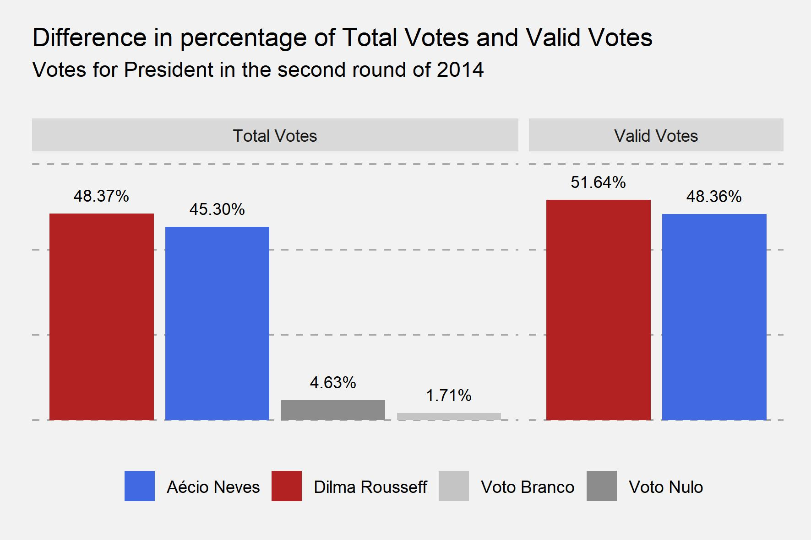
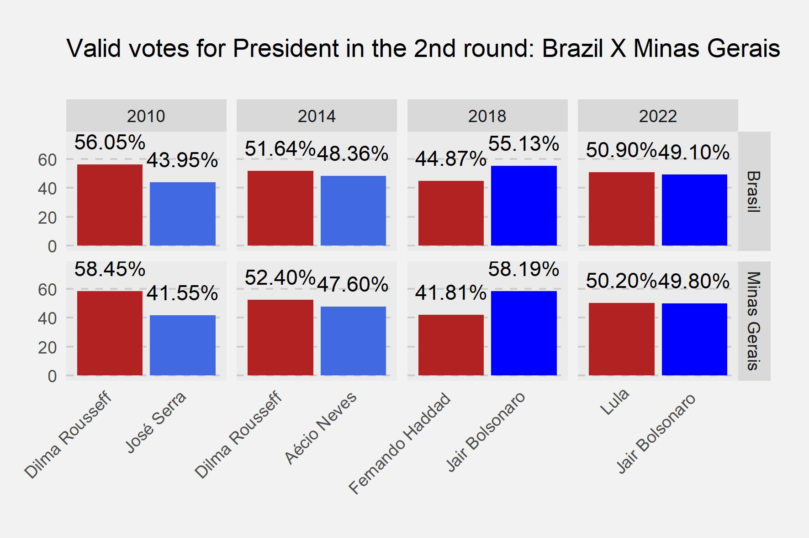
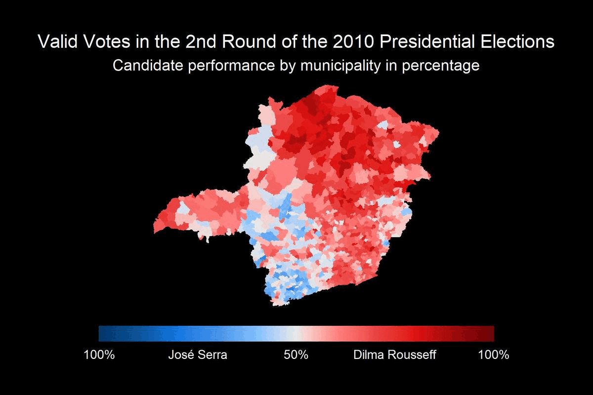

# Analysis of electoral performances in Minas Gerais (2010-2022)

Minas Gerais is a decisive state for Brazilian elections, not only because of its 20 million inhabitants and 16 million voters (10.41% of the national electorate), but also because, since redemocratization in 1985, all elected Presidents have obtained a majority in the State.

in Brazil, the computation is done considering each vote individually, the winner is whoever reaches the majority of valid votes (excluding blank and null votes).

Thus, although there is this coincidence between the Minas Gerais and Brazilian elections, the State is not decisive for the victory of a candidate, and the performance of a candidate may be much better in other States enough to guarantee victory.

However, this coincidence has occurred since the redemocratization.

Despite this eventuality, the distribution of votes in the State has changed over the years, following the political transformations in the country.

From a more homogeneous distribution in the State, it moved to a heterogeneous distribution demarcated by the mesoregions.

Fonte: https://dadosabertos.tse.jus.br/dataset/

